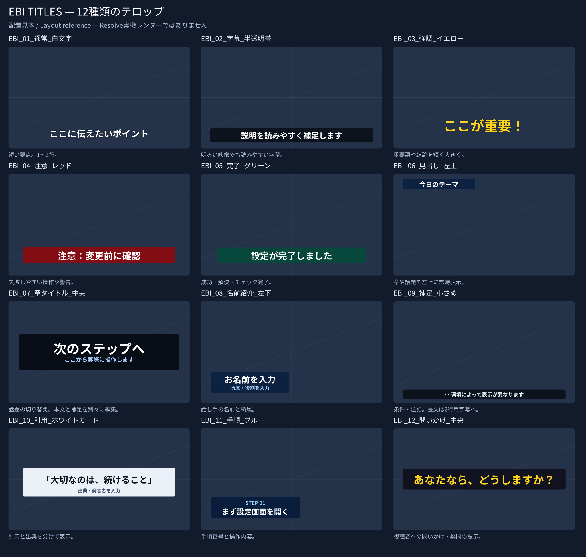

# EBI title library

Twelve original, editable Japanese title designs are included in the Studio
workflow's `テンプレート.drp` Media Pool and as Fusion Titles under
`Edit/Titles/EBI/`. Choose the `EBI_01_…` through `EBI_12_…` items by their
Japanese purpose names. The existing `テロップ` and `main` timeline are preserved.



| No. | Japanese label | Use |
|---|---|---|
| 01 | 通常 | White outlined text for short points |
| 02 | 字幕 | Subtitles over a translucent dark band |
| 03 | 強調 | Large yellow emphasis |
| 04 | 注意 | Red warning banner |
| 05 | 完了 | Green completion banner |
| 06 | 見出し | Persistent topic label at the upper left |
| 07 | 章タイトル | Centered chapter card with a second line |
| 08 | 名前紹介 | Lower third with a name and role |
| 09 | 補足 | Small footnote over a translucent band |
| 10 | 引用 | Light quote card with a source line |
| 11 | 手順 | Step number and instruction |
| 12 | 問いかけ | Centered question |

## Use in an editing project

1. Run the usual **Stable** or **Dual Source** launcher. After its repository
   update, it installs the bundled `.setting` files in the current user's Fusion
   Titles folder, then runs the existing editor.
2. In the generated project's Media Pool, search for `EBI_`. Drag a title onto a
   video track above the footage: V2 or higher for the stable route, **V3 or
   higher for dual source**, whose V2 already holds the camera.
3. Select the title and edit **Text / 本文** in the Inspector. Titles with a
   secondary line also expose **Second line / 補足**. Size, font, style and
   whole-title position/scale are exposed; banner titles expose color, opacity,
   width and height.
4. Trim the title to the duration you need. These are intentionally static,
   with no fixed-time animation or external image dependencies. For a simple
   fade, use the Edit page clip fade handles.

For the Effects Library, search for `EBI` under Titles. If Resolve was already
running when the presets were installed, save your work and restart Resolve
when convenient. The installer never restarts it automatically.

To install the Effects Library titles without editing a new video:

```powershell
& ".\有償版用スクリプト\install_title_presets.ps1"
```

The PowerShell installer first attempts the same safe repository update as the
editing launchers. Its Python counterpart can also be run directly on Windows,
macOS or Linux:

```text
python 有償版用スクリプト/install_title_presets.py
```

No new Python packages are required on the editing PC. The default Windows
folder is `%APPDATA%\Blackmagic Design\DaVinci Resolve\Support\Fusion\Templates\Edit\Titles\EBI`.
Only bundled `.setting` files are installed, not scripts, fonts or plugins.

The manifest tracks installed file hashes. Identical files are left alone;
previously installed unmodified files can be upgraded. An existing file that
was customized locally is preserved and reported. To preserve a customized
look permanently, save it under your own new name. To deliberately restore a
bundled look, move your customized copy elsewhere and run the installer again.

Existing projects are not rewritten. They can use the newly installed Effects
Library titles. The Advanced FFmpeg editing route and the separate free-version
DRP are not changed by this library.

## If an existing title says “No frame available for MediaOut1”

The initial DRP used a MediaOut port reference that did not match the macro's
published output. The corrected DRP applies to new projects. To repair existing
clips without rebuilding the edit, open the affected timeline and run
`有償版用スクリプト/repair_title_outputs.ps1` from the updated repository.
It exports a project backup before reconnecting missing outputs, and preserves
text and clip timing. See the [diagnosis and validation status](../docs/kb/ebi-title-mediaout-no-frame.md).

## Typography and placement

The default family/style is `HGPSoeiKakugothicUB / Regular`, matching the original
project asset. This font is **not bundled**. If it is unavailable, choose an
installed Japanese font and its matching style in the Inspector. Titles with
two lines expose separate font controls for each text node.

Start with short phrases: about 20 Japanese characters per line for wide
banners, 10 for the small topic/name labels, and 14 for the step instruction.
These are design guidelines, not automatic text fitting. Use line breaks or
reduce the text size for longer phrases, and adjust band height for two lines.
The library targets landscape 16:9; portrait layouts need manual repositioning.
The small note is a footnote, not a substitute for readable primary captions.

`Position / 全体の位置` moves the complete design; `Scale / 全体の大きさ` scales
text and graphics together. Keep the camera face and slide content visible.
Do not place chapter cards over material that the audience needs to read.

## Build and validation

`presets.json` is the source of truth. `tools/title_graph.py` builds the original
Fusion macro graphs. `tools/build_title_presets.py` writes the `.setting` files
and adds independent generator records to the Media Pool in the existing DRP.
It does not alter any timeline/archive member outside the Master Media Pool.
The original generator is unchanged. New copies omit its Edit-page position
override so that the Fusion layout owns positioning.

The DRP adapter follows the bundled Resolve **20.2.1** archive's serialization.
That file format is not a public scripting API. Keep the source DRP in Git and
review any template-version change before rebuilding. Build dependencies are
for maintainers only:

```text
python -m pip install -r requirements-dev.txt
python tools/build_title_presets.py
python tools/title_catalog.py
python -m pytest -q
```

Automated checks cover Lua syntax, node connections and published controls,
DRP CRC/container lengths, independent identities, generator names, preservation
of other project members, idempotent rebuilding and customized-file protection.
The catalog is a **schematic layout reference**, not a screenshot or a render
from Resolve. Font metrics, color management and antialiasing can differ.

**Resolve GUI import/render validation is still required on the editing PC.**
The authoring environment has no Resolve instance. Confirm that all 12 assets
import, their Inspector fields appear, changing one copy does not affect other
copies, and 2/5/15-second trims render correctly. Verify Japanese fonts and
readability against actual screen/camera footage. Structural tests cannot prove
these application-level behaviors.

## Tutorial references

The designs and code are original. No third-party title packs are redistributed.
The implementation follows techniques explained in these primary sources:

- [Blackmagic: The Visual Effects Guide to DaVinci Resolve 20](https://documents.blackmagicdesign.com/UserManuals/DaVinci-Resolve-20-Fusion-Visual-Effects.pdf),
  lesson 6, printed pages 139–167: Text+, lower thirds, background banners,
  secondary text and saving reusable templates.
- [Blackmagic: Fusion 19 Reference Manual](https://documents.blackmagicdesign.com/UserManuals/Fusion19_0_Manual.pdf),
  chapter 6, pages 170–174: macros, Inspector controls and title installation.
- [VFXstudy: Fusion Quick Start](https://vfxstudy.com/tutorials/quick-start/):
  basic compositing and placing text over imagery. This static collection does
  not implement that tutorial's animation or foreground masking.
